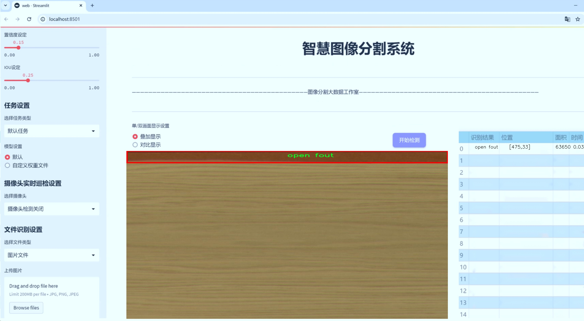
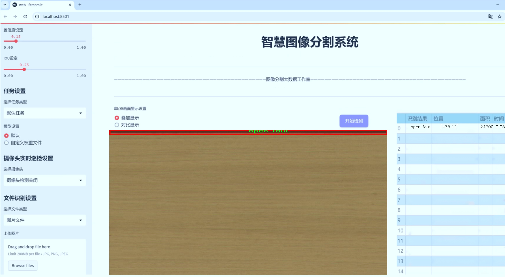
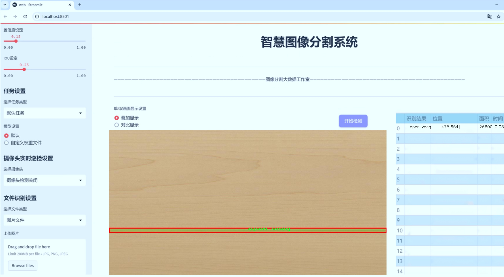
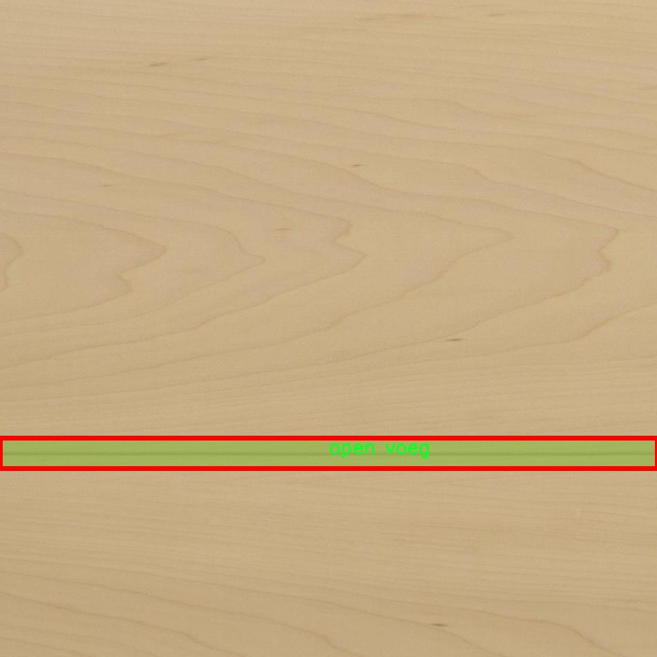
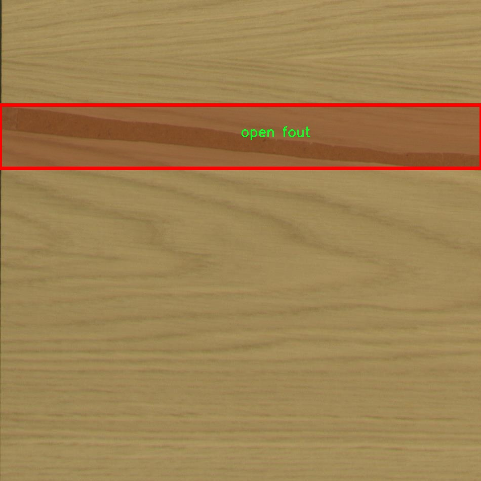
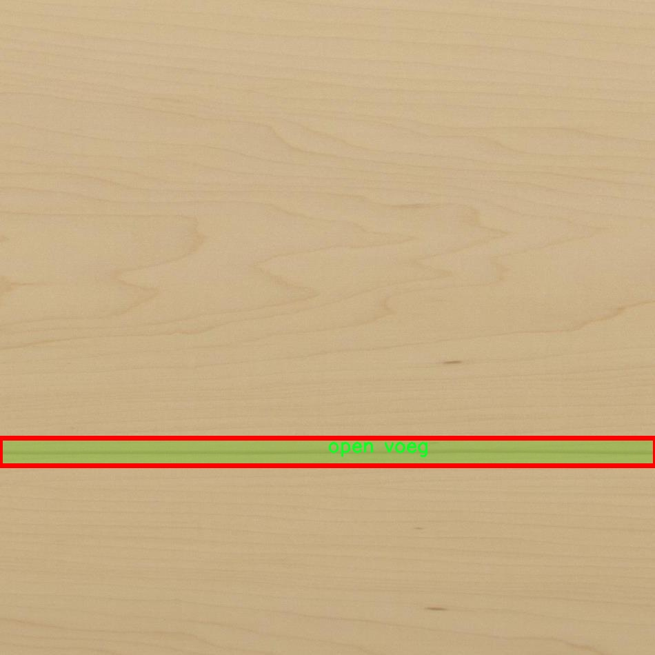
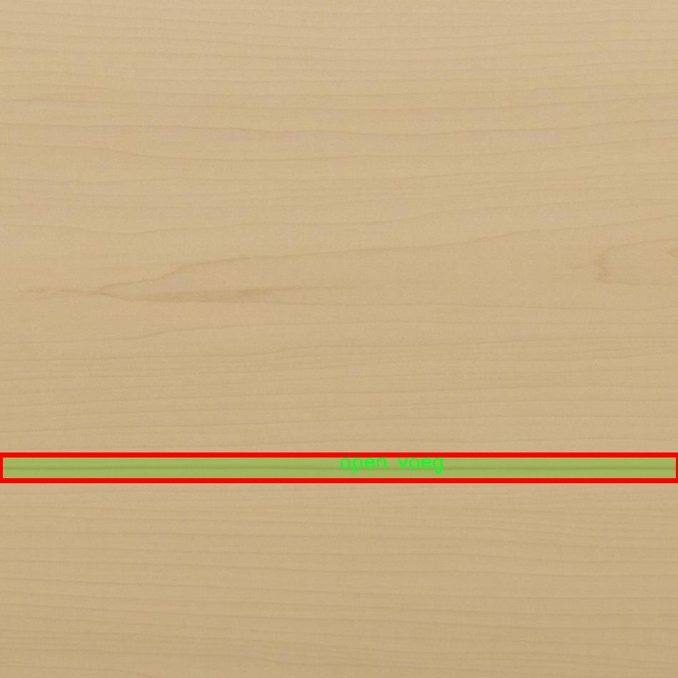
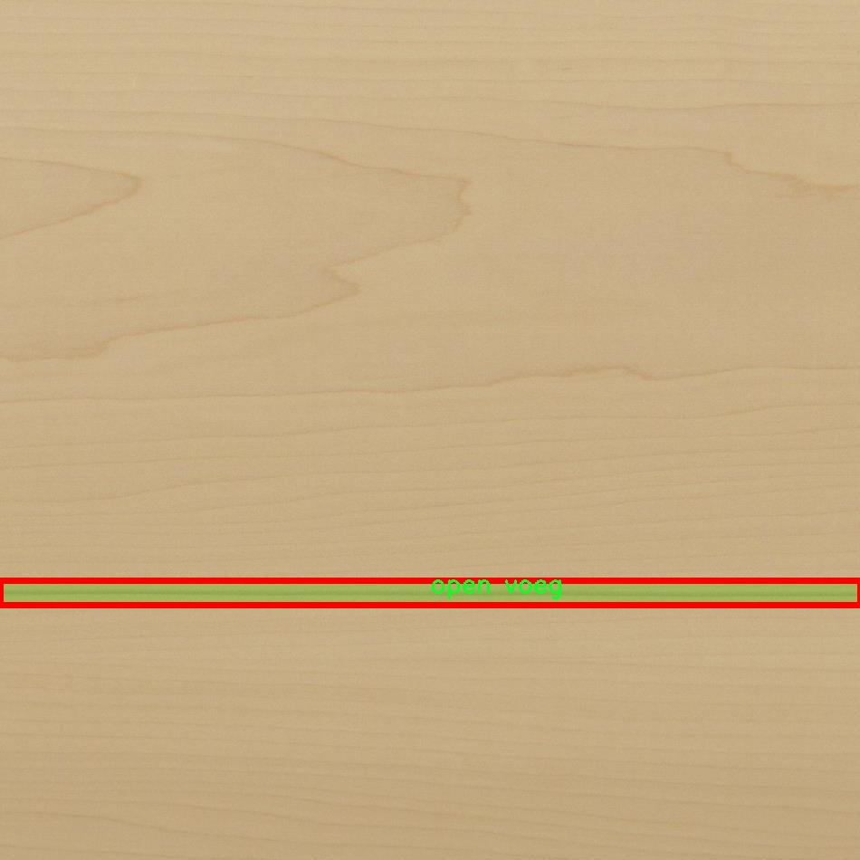

# 木材单板缺陷分割系统源码＆数据集分享
 [yolov8-seg-C2f-EMBC＆yolov8-seg-repvit等50+全套改进创新点发刊_一键训练教程_Web前端展示]

### 1.研究背景与意义

项目参考[ILSVRC ImageNet Large Scale Visual Recognition Challenge](https://gitee.com/YOLOv8_YOLOv11_Segmentation_Studio/projects)

项目来源[AAAI Global Al lnnovation Contest](https://kdocs.cn/l/cszuIiCKVNis)

研究背景与意义

随着木材工业的快速发展，木材单板在建筑、家具和装饰等领域的应用愈加广泛。然而，木材单板在生产和加工过程中常常会出现各种缺陷，如裂纹、虫蛀、变色等，这些缺陷不仅影响了木材的美观性和使用性能，还可能导致经济损失。因此，如何有效地检测和分割木材单板的缺陷，成为了木材加工行业亟待解决的重要问题。

传统的木材缺陷检测方法多依赖人工视觉检查，这种方法不仅耗时耗力，而且容易受到主观因素的影响，导致检测结果的不准确性和不一致性。随着计算机视觉技术的不断进步，基于深度学习的自动化缺陷检测方法逐渐崭露头角。其中，YOLO（You Only Look Once）系列模型因其高效的实时检测能力而受到广泛关注。YOLOv8作为该系列的最新版本，具备了更强的特征提取能力和更高的检测精度，为木材单板缺陷检测提供了新的解决方案。

本研究旨在基于改进的YOLOv8模型，构建一个高效的木材单板缺陷分割系统。该系统将利用一个包含2900张图像和11个类别的专用数据集进行训练和测试。数据集中包含的缺陷类别包括：barst（裂纹）、deuk（虫蛀）、kras（变色）、ongekend（未知缺陷）、open fout（开放缺陷）、open knop（开放结疤）、open voeg（开放接缝）、snijfout（切割缺陷）、veneer piece（单板片）、vlek（污点）和zaag（锯痕）。这些类别涵盖了木材单板中常见的缺陷类型，为模型的训练提供了丰富的样本数据。

通过对YOLOv8模型的改进，我们将针对木材单板缺陷的特征进行优化，以提高模型在分割任务中的表现。具体而言，我们将引入数据增强技术，以扩充训练样本的多样性，并采用迁移学习策略，利用预训练模型加速收敛过程。此外，针对木材单板的特定特征，我们还将设计适应性强的损失函数，以提升模型对不同缺陷类型的识别能力。

本研究的意义不仅在于推动木材单板缺陷检测技术的发展，更在于为木材加工行业提供一种高效、自动化的解决方案，降低人工成本，提高生产效率。通过实现对木材单板缺陷的快速、准确分割，我们将能够为后续的质量控制和产品优化提供有力支持，进而提升木材产品的市场竞争力。

综上所述，基于改进YOLOv8的木材单板缺陷分割系统的研究，具有重要的理论价值和实际应用意义。它不仅为深度学习在木材加工领域的应用提供了新的思路，也为相关研究者提供了一个可供参考的模型框架。通过不断优化和完善该系统，我们期望能够在未来的木材工业中实现更高效的缺陷检测和质量控制，为可持续发展贡献一份力量。

### 2.图片演示







##### 注意：由于此博客编辑较早，上面“2.图片演示”和“3.视频演示”展示的系统图片或者视频可能为老版本，新版本在老版本的基础上升级如下：（实际效果以升级的新版本为准）

  （1）适配了YOLOV8的“目标检测”模型和“实例分割”模型，通过加载相应的权重（.pt）文件即可自适应加载模型。

  （2）支持“图片识别”、“视频识别”、“摄像头实时识别”三种识别模式。

  （3）支持“图片识别”、“视频识别”、“摄像头实时识别”三种识别结果保存导出，解决手动导出（容易卡顿出现爆内存）存在的问题，识别完自动保存结果并导出到tempDir中。

  （4）支持Web前端系统中的标题、背景图等自定义修改，后面提供修改教程。

  另外本项目提供训练的数据集和训练教程,暂不提供权重文件（best.pt）,需要您按照教程进行训练后实现图片演示和Web前端界面演示的效果。

### 3.视频演示

[3.1 视频演示](https://www.bilibili.com/video/BV17z2hY6E8s/)

### 4.数据集信息展示

##### 4.1 本项目数据集详细数据（类别数＆类别名）

nc: 11
names: ['barst', 'deuk', 'kras', 'ongekend', 'open fout', 'open knop', 'open voeg', 'snijfout', 'veneer piece', 'vlek', 'zaag']


##### 4.2 本项目数据集信息介绍

数据集信息展示

在现代木材加工行业中，木材单板的质量直接影响到最终产品的价值和市场竞争力。因此，开发一个高效的木材单板缺陷分割系统显得尤为重要。本研究旨在利用改进的YOLOv8-seg模型，通过精确的缺陷检测与分割，提升木材单板的质量控制水平。为此，我们构建了一个名为“Dcp”的数据集，专门用于训练和评估该系统的性能。

“Dcp”数据集包含11个不同的缺陷类别，这些类别涵盖了木材单板在生产和加工过程中可能出现的各种问题。具体来说，这些类别包括：barst（裂缝）、deuk（凹陷）、kras（划痕）、ongekend（未知缺陷）、open fout（开放性缺陷）、open knop（开放性结疤）、open voeg（开放性接缝）、snijfout（切割缺陷）、veneer piece（单板片）、vlek（污点）以及zaag（锯痕）。每个类别都代表了特定的缺陷类型，这些缺陷不仅影响木材的美观，还可能影响其结构强度和使用寿命。

在数据集的构建过程中，我们收集了大量的木材单板图像，这些图像来源于不同的木材加工企业，涵盖了多种木材种类和加工工艺。每张图像都经过精心标注，确保每个缺陷都被准确地识别和分类。这一过程不仅需要专业的木材加工知识，还需要对图像处理和机器学习有深入的理解，以确保数据集的高质量和实用性。

数据集中的图像分辨率和质量也经过严格控制，以确保模型在训练过程中能够获得足够的特征信息。我们采用了多种拍摄角度和光照条件，以增强数据集的多样性，从而提高模型的泛化能力。此外，为了应对不同环境下的实际应用需求，我们还对数据集进行了数据增强处理，包括旋转、缩放、裁剪和颜色变换等操作，以模拟各种可能的使用场景。

在模型训练过程中，Dcp数据集将作为基础数据源，帮助YOLOv8-seg模型学习如何有效地识别和分割不同类型的木材缺陷。通过使用该数据集，我们期望能够提高模型的检测精度和分割效果，从而实现对木材单板缺陷的自动化识别和处理。这不仅能够减少人工检查的工作量，还能提高生产效率和产品质量，为木材加工行业带来显著的经济效益。

总之，Dcp数据集的构建和应用将为木材单板缺陷分割系统的研究提供坚实的基础。通过对该数据集的深入分析和应用，我们希望能够推动木材加工行业的智能化发展，提升木材产品的整体质量和市场竞争力。随着技术的不断进步和数据集的不断完善，我们相信，这一研究将为未来的木材加工技术创新开辟新的方向。











### 5.全套项目环境部署视频教程（零基础手把手教学）

[5.1 环境部署教程链接（零基础手把手教学）](https://www.bilibili.com/video/BV1jG4Ve4E9t/?vd_source=bc9aec86d164b67a7004b996143742dc)


[5.2 安装Python虚拟环境创建和依赖库安装视频教程链接（零基础手把手教学）](https://www.bilibili.com/video/BV1nA4VeYEze/?vd_source=bc9aec86d164b67a7004b996143742dc)

### 6.手把手YOLOV8-seg训练视频教程（零基础小白有手就能学会）

[6.1 手把手YOLOV8-seg训练视频教程（零基础小白有手就能学会）](https://www.bilibili.com/video/BV1cA4VeYETe/?vd_source=bc9aec86d164b67a7004b996143742dc)


按照上面的训练视频教程链接加载项目提供的数据集，运行train.py即可开始训练



     Epoch   gpu_mem       box       obj       cls    labels  img_size
     1/200     0G   0.01576   0.01955  0.007536        22      1280: 100%|██████████| 849/849 [14:42<00:00,  1.04s/it]
               Class     Images     Labels          P          R     mAP@.5 mAP@.5:.95: 100%|██████████| 213/213 [01:14<00:00,  2.87it/s]
                 all       3395      17314      0.994      0.957      0.0957      0.0843

     Epoch   gpu_mem       box       obj       cls    labels  img_size
     2/200     0G   0.01578   0.01923  0.007006        22      1280: 100%|██████████| 849/849 [14:44<00:00,  1.04s/it]
               Class     Images     Labels          P          R     mAP@.5 mAP@.5:.95: 100%|██████████| 213/213 [01:12<00:00,  2.95it/s]
                 all       3395      17314      0.996      0.956      0.0957      0.0845

     Epoch   gpu_mem       box       obj       cls    labels  img_size
     3/200     0G   0.01561    0.0191  0.006895        27      1280: 100%|██████████| 849/849 [10:56<00:00,  1.29it/s]
               Class     Images     Labels          P          R     mAP@.5 mAP@.5:.95: 100%|███████   | 187/213 [00:52<00:00,  4.04it/s]
                 all       3395      17314      0.996      0.957      0.0957      0.0845


### 7.50+种全套YOLOV8-seg创新点代码加载调参视频教程（一键加载写好的改进模型的配置文件）

[7.1 50+种全套YOLOV8-seg创新点代码加载调参视频教程（一键加载写好的改进模型的配置文件）](https://www.bilibili.com/video/BV1Hw4VePEXv/?vd_source=bc9aec86d164b67a7004b996143742dc)

### 8.YOLOV8-seg图像分割算法原理

原始YOLOv8-seg算法原理

YOLOv8-seg算法是YOLO系列中的最新版本，专注于目标检测与分割任务，展现出卓越的性能与效率。相较于前代YOLOv5，YOLOv8在检测精度和速度上都有显著提升。该算法的设计理念是通过深度学习网络的优化，使得目标检测与分割能够在实时性和准确性之间取得良好的平衡。YOLOv8-seg不仅继承了YOLO系列的单阶段检测特性，还在此基础上引入了更为复杂的分割机制，使得算法能够在更广泛的应用场景中发挥作用。

YOLOv8-seg的网络结构可以分为四个主要部分：输入端、骨干网络、颈部网络和头部网络。输入端负责对输入图像进行预处理，包括马赛克数据增强、自适应锚框计算和自适应灰度填充等操作。这些预处理步骤旨在提高模型对不同输入数据的适应能力，从而提升整体检测性能。通过马赛克增强，算法能够更好地处理不同尺寸和比例的目标，增强了模型的鲁棒性。

在骨干网络部分，YOLOv8-seg采用了改进的C2f结构和SPPF（Spatial Pyramid Pooling Fusion）模块。C2f模块通过引入更多的分支和跨层连接，增强了特征学习的能力，使得模型能够捕捉到更丰富的特征信息。SPPF模块则通过不同内核尺寸的池化操作，进一步融合了特征图中的信息，提升了模型对多尺度目标的检测能力。这种结构的设计不仅提高了特征提取的效率，也使得模型在面对复杂场景时，能够保持较高的准确性。

颈部网络采用了路径聚合网络（PAN）结构，这一设计使得YOLOv8-seg在特征融合方面表现得尤为出色。PAN结构通过将语义特征与定位特征进行有效结合，增强了模型对不同尺度目标的检测能力。该结构的优势在于能够在不同层次上获取特征信息，从而实现更为精准的目标定位与分割。这一特性对于需要高精度分割的应用场景，如医学影像分析和自动驾驶等，具有重要意义。

头部网络则是YOLOv8-seg的核心部分，负责最终的目标检测与分割任务。与以往版本不同，YOLOv8-seg将分类和检测过程进行了有效解耦，采用了主流的解耦头结构。这一结构的优势在于能够独立优化分类和回归任务，提升了模型的整体性能。头部网络中的损失计算过程采用了Task-Aligned Assigner策略，通过对正负样本的合理分配，确保了模型在训练过程中的稳定性与高效性。此外，YOLOv8-seg在损失计算中结合了二元交叉熵损失和分布焦点损失，进一步提升了边界框预测的准确性。

值得一提的是，YOLOv8-seg在设计上采用了无锚框检测机制，这一创新使得模型在处理目标时，能够减少锚框预测的数量，从而加速了非最大抑制（NMS）过程。这一改进不仅提高了检测速度，也在一定程度上降低了模型的复杂性，使得YOLOv8-seg在实时应用中表现得更加出色。

YOLOv8-seg的应用场景广泛，包括智能监控、自动驾驶、医学影像分析等领域。其高效的目标检测与分割能力，使得该算法在实际应用中能够快速响应并提供高质量的结果。例如，在智能监控中，YOLOv8-seg能够实时识别并分割出监控画面中的行人、车辆等目标，提升了安全监控的效率。在自动驾驶领域，该算法能够精准识别道路上的行人和障碍物，为车辆的决策提供重要依据。

总的来说，YOLOv8-seg算法通过一系列创新设计，显著提升了目标检测与分割的性能。其深度学习网络的优化、特征融合能力的增强以及无锚框检测机制的引入，使得YOLOv8-seg在处理复杂场景时，能够保持高效与准确。随着YOLOv8-seg的不断发展与应用，未来将会在更多领域展现出其强大的潜力与价值。


### 9.系统功能展示（检测对象为举例，实际内容以本项目数据集为准）

图9.1.系统支持检测结果表格显示

  图9.2.系统支持置信度和IOU阈值手动调节

  图9.3.系统支持自定义加载权重文件best.pt(需要你通过步骤5中训练获得)

  图9.4.系统支持摄像头实时识别

  图9.5.系统支持图片识别

  图9.6.系统支持视频识别

  图9.7.系统支持识别结果文件自动保存

  图9.8.系统支持Excel导出检测结果数据


### 10.50+种全套YOLOV8-seg创新点原理讲解（非科班也可以轻松写刊发刊，V11版本正在科研待更新）

#### 10.1 由于篇幅限制，每个创新点的具体原理讲解就不一一展开，具体见下列网址中的创新点对应子项目的技术原理博客网址【Blog】：


[10.1 50+种全套YOLOV8-seg创新点原理讲解链接](https://gitee.com/qunmasj/good)

#### 10.2 部分改进模块原理讲解(完整的改进原理见上图和技术博客链接)【如果此小节的图加载失败可以通过CSDN或者Github搜索该博客的标题访问原始博客，原始博客图片显示正常】

### YOLOv8简介


由上图可以看出，C2中每个BottlNeck的输入Tensor的通道数channel都只是上一级的0.5倍，因此计算量明显降低。从另一方面讲，梯度流的增加，t也能够明显提升收敛速度和收敛效果。
C2i模块首先以输入tensor(n.c.h.w)经过Conv1层进行split拆分，分成两部分(n,0.5c,h,w)，一部分直接经过n个Bottlenck，另一部分经过每一操作层后都会以(n.0.5c,h,w)的尺寸进行Shortcut，最后通过Conv2层卷积输出。也就是对应n+2的Shortcut(第一层Conv1的分支tensor和split后的tensor为2+n个bottenlenneck)。
#### Neck
YOLOv8的Neck采用了PANet结构，如下图所示。

Backbone最后SPPF模块(Layer9)之后H、W经过32倍下采样，对应地Layer4经过8倍下采样，Layer6经过16倍下采样。输入图片分辨率为640*640，得到Layer4、Layer6、Layer9的分辨率分别为80*80、40*40和20*20。
Layer4、Layer6、Layer9作为PANet结构的输入，经过上采样，通道融合，最终将PANet的三个输出分支送入到Detect head中进行Loss的计算或结果解算。
与FPN(单向，自上而下)不同的是，PANet是一个双向通路网络，引入了自下向上的路径，使得底层信息更容易传递到顶层。
#### Head
Head部分相比Yolov5改动较大，直接将耦合头改为类似Yolo的解耦头结构(Decoupled-Head)，将回归分支和预测分支分离，并针对回归分支使用了Distribution Focal Loss策略中提出的积分形式表示法。之前的目标检测网络将回归坐标作为一个确定性单值进行预测，DFL将坐标转变成一个分布。


### LSKNet的架构
该博客提出的结构层级依次为：

LSK module（大核卷积序列+空间选择机制） < LSK Block （LK Selection + FFN）<LSKNet（N个LSK Block）


#### LSK 模块

LSK Block
LSKNet 是主干网络中的一个可重复堆叠的块（Block），每个LSK Block包括两个残差子块，即大核选择子块（Large Kernel Selection，LK Selection）和前馈网络子块（Feed-forward Network ，FFN），如图8。LK Selection子块根据需要动态地调整网络的感受野，FFN子块用于通道混合和特征细化，由一个全连接层、一个深度卷积、一个 GELU 激活和第二个全连接层组成。

LSK module（LSK 模块，图4）由一个大核卷积序列（large kernel convolutions）和一个空间核选择机制（spatial kernel selection mechanism）组成，被嵌入到了LSK Block 的 LK Selection子块中。

#### Large Kernel Convolutions
因为不同类型的目标对背景信息的需求不同，这就需要模型能够自适应选择不同大小的背景范围。因此，作者通过解耦出一系列具有大卷积核、且不断扩张的Depth-wise 卷积，构建了一个更大感受野的网络。

具体地，假设序列中第i个Depth-wise 卷积核的大小为 ，扩张率为 d，感受野为 ，它们满足以下关系：


卷积核大小和扩张率的增加保证了感受野能够快速增大。此外，我们设置了扩张率的上限，以保证扩张卷积不会引入特征图之间的差距。


Table2的卷积核大小可根据公式（1）和（2）计算，详见下图：


这样设计的好处有两点。首先，能够产生具有多种不同大小感受野的特征，便于后续的核选择；第二，序列解耦比简单的使用一个大型卷积核效果更好。如上图表2所示，解耦操作相对于标准的大型卷积核，有效地将低了模型的参数量。

为了从输入数据  的不同区域获取丰富的背景信息特征，可采用一系列解耦的、不用感受野的Depth-wise 卷积核：


其中，是卷积核为 、扩张率为  的Depth-wise 卷积操作。假设有个解耦的卷积核，每个卷积操作后又要经过一个的卷积层进行空间特征向量的通道融合。


之后，针对不同的目标，可基于获取的多尺度特征，通过下文中的选择机制动态选择合适的卷积核大小。

这一段的意思可以简单理解为：

把一个大的卷积核拆成了几个小的卷积核，比如一个大小为5，扩张率为1的卷积核加上一个大小为7，扩张率为3的卷积核，感受野为23，与一个大小为23，扩张率为1的卷积核的感受野是一样的。因此可用两个小的卷积核替代一个大的卷积核，同理一个大小为29的卷积核也可以用三个小的卷积代替（Table 2），这样可以有效的减少参数，且更灵活。

将输入数据依次通过这些小的卷积核（公式3），并在每个小的卷积核后面接上一个1×1的卷积进行通道融合（公式4）。

#### Spatial Kernel Selection
为了使模型更关注目标在空间上的重点背景信息，作者使用空间选择机制从不同尺度的大卷积核中对特征图进行空间选择。

首先，将来自于不同感受野卷积核的特征进行concate拼接，然后，应用通道级的平均池化和最大池化提取空间关系，其中， 和  是平均池化和最大池化后的空间特征描述符。为了实现不同空间描述符的信息交互，作者利用卷积层将空间池化特征进行拼接，将2个通道的池化特征转换为N个空间注意力特征图，之后，将Sigmoid激活函数应用到每一个空间注意力特征图，可获得每个解耦的大卷积核所对应的独立的空间选择掩膜，又然后，将解耦后的大卷积核序列的特征与对应的空间选择掩膜进行加权处理，并通过卷积层进行融合获得注意力特征 ，最后LSK module的输出可通过输入特征  与注意力特征  的逐元素点成获得，公式对应于结构图上的操作如下：


### 11.项目核心源码讲解（再也不用担心看不懂代码逻辑）

#### 11.1 ultralytics\models\sam\modules\sam.py

下面是对代码的核心部分进行分析和详细注释的结果：

```python
# 导入必要的库
from typing import List
import torch
from torch import nn

# 导入解码器和编码器
from .decoders import MaskDecoder
from .encoders import ImageEncoderViT, PromptEncoder

class Sam(nn.Module):
    """
    Sam（Segment Anything Model）旨在进行对象分割任务。它使用图像编码器生成图像嵌入，并使用提示编码器对各种类型的输入提示进行编码。
    这些嵌入随后被掩码解码器用于预测对象掩码。

    属性：
        mask_threshold (float): 掩码预测的阈值。
        image_format (str): 输入图像的格式，默认为 'RGB'。
        image_encoder (ImageEncoderViT): 用于将图像编码为嵌入的主干网络。
        prompt_encoder (PromptEncoder): 编码各种类型的输入提示。
        mask_decoder (MaskDecoder): 从图像和提示嵌入中预测对象掩码。
        pixel_mean (List[float]): 用于图像归一化的均值像素值。
        pixel_std (List[float]): 用于图像归一化的标准差值。
    """
    # 掩码预测的阈值，初始化为0.0
    mask_threshold: float = 0.0
    # 输入图像的格式，默认为 'RGB'
    image_format: str = 'RGB'

    def __init__(
        self,
        image_encoder: ImageEncoderViT,  # 图像编码器
        prompt_encoder: PromptEncoder,    # 提示编码器
        mask_decoder: MaskDecoder,        # 掩码解码器
        pixel_mean: List[float] = (123.675, 116.28, 103.53),  # 像素均值
        pixel_std: List[float] = (58.395, 57.12, 57.375)      # 像素标准差
    ) -> None:
        """
        初始化 Sam 类，以从图像和输入提示中预测对象掩码。

        注意：
            所有的 forward() 操作已移至 SAMPredictor。

        参数：
            image_encoder (ImageEncoderViT): 用于将图像编码为图像嵌入的主干网络。
            prompt_encoder (PromptEncoder): 编码各种类型的输入提示。
            mask_decoder (MaskDecoder): 从图像嵌入和编码的提示中预测掩码。
            pixel_mean (List[float], optional): 用于归一化输入图像中像素的均值，默认为 (123.675, 116.28, 103.53)。
            pixel_std (List[float], optional): 用于归一化输入图像中像素的标准差，默认为 (58.395, 57.12, 57.375)。
        """
        super().__init__()  # 调用父类 nn.Module 的初始化方法
        self.image_encoder = image_encoder  # 初始化图像编码器
        self.prompt_encoder = prompt_encoder  # 初始化提示编码器
        self.mask_decoder = mask_decoder  # 初始化掩码解码器
        # 注册像素均值和标准差为缓冲区，便于后续使用
        self.register_buffer('pixel_mean', torch.Tensor(pixel_mean).view(-1, 1, 1), False)
        self.register_buffer('pixel_std', torch.Tensor(pixel_std).view(-1, 1, 1), False)
```

### 代码分析：
1. **类定义**：`Sam` 类继承自 `nn.Module`，是一个用于对象分割的模型。
2. **属性**：
   - `mask_threshold`：用于控制掩码预测的阈值。
   - `image_format`：指定输入图像的格式。
   - `image_encoder`、`prompt_encoder` 和 `mask_decoder` 分别用于图像编码、提示编码和掩码解码。
   - `pixel_mean` 和 `pixel_std` 用于图像的归一化处理。
3. **初始化方法**：在初始化时，传入编码器和解码器的实例，并注册像素均值和标准差为模型的缓冲区，以便在模型的前向传播中使用。

这段代码的核心在于定义了一个用于对象分割的模型结构，明确了各个组件的作用和初始化方式。

该文件定义了一个名为 `Sam` 的类，属于 Ultralytics YOLO 项目的一部分，主要用于对象分割任务。该类继承自 PyTorch 的 `nn.Module`，并包含多个组件，用于处理图像和输入提示，以生成对象掩码。

在类的文档字符串中，详细描述了 `Sam` 类的功能和属性。该模型使用图像编码器生成图像嵌入，并通过提示编码器对各种类型的输入提示进行编码。这些嵌入随后被掩码解码器用于预测对象掩码。类的主要属性包括：

- `mask_threshold`：用于掩码预测的阈值。
- `image_format`：输入图像的格式，默认为 'RGB'。
- `image_encoder`：用于将图像编码为嵌入的主干网络，类型为 `ImageEncoderViT`。
- `prompt_encoder`：用于编码各种类型输入提示的编码器，类型为 `PromptEncoder`。
- `mask_decoder`：根据图像和提示嵌入预测对象掩码的解码器，类型为 `MaskDecoder`。
- `pixel_mean` 和 `pixel_std`：用于图像归一化的均值和标准差。

在 `__init__` 方法中，初始化了 `Sam` 类的实例。该方法接受三个主要参数：`image_encoder`、`prompt_encoder` 和 `mask_decoder`，分别用于图像嵌入的生成、输入提示的编码和掩码的预测。此外，还可以传入用于图像归一化的均值和标准差，默认值已在文档中说明。

在初始化过程中，调用了父类的构造函数，并将传入的编码器和解码器实例赋值给相应的属性。同时，使用 `register_buffer` 方法注册了均值和标准差，以便在模型训练和推理时使用。这些缓冲区不会被视为模型的参数，但在模型保存和加载时会被包含在内。

总的来说，该文件定义了一个用于对象分割的模型框架，整合了图像编码、提示编码和掩码解码的功能，为后续的掩码预测提供了基础。

#### 11.2 ultralytics\nn\modules\head.py

以下是经过简化和注释的核心代码部分，主要集中在 `Detect` 类及其功能上。这个类是 YOLOv8 模型的检测头，负责处理输入特征并输出边界框和类别概率。

```python
import torch
import torch.nn as nn
from .conv import Conv
from .utils import dist2bbox, make_anchors

class Detect(nn.Module):
    """YOLOv8 检测头，用于目标检测模型。"""
    
    def __init__(self, nc=80, ch=()):
        """初始化 YOLOv8 检测层，指定类别数和通道数。
        
        参数:
            nc (int): 类别数量，默认为 80。
            ch (tuple): 输入特征图的通道数。
        """
        super().__init__()
        self.nc = nc  # 类别数量
        self.nl = len(ch)  # 检测层数量
        self.reg_max = 16  # DFL 通道数
        self.no = nc + self.reg_max * 4  # 每个锚点的输出数量
        self.stride = torch.zeros(self.nl)  # 在构建时计算的步幅

        # 定义卷积层，cv2用于边界框回归，cv3用于类别预测
        c2, c3 = max((16, ch[0] // 4, self.reg_max * 4)), max(ch[0], min(self.nc, 100))
        self.cv2 = nn.ModuleList(
            nn.Sequential(Conv(x, c2, 3), Conv(c2, c2, 3), nn.Conv2d(c2, 4 * self.reg_max, 1)) for x in ch)
        self.cv3 = nn.ModuleList(nn.Sequential(Conv(x, c3, 3), Conv(c3, c3, 3), nn.Conv2d(c3, self.nc, 1)) for x in ch)

    def forward(self, x):
        """连接并返回预测的边界框和类别概率。
        
        参数:
            x (list): 输入特征图列表，形状为 [B, C, H, W]。
        
        返回:
            y (tensor): 输出的边界框和类别概率。
        """
        shape = x[0].shape  # 获取输入形状 BCHW
        for i in range(self.nl):
            # 对每个检测层的输入进行卷积操作并连接结果
            x[i] = torch.cat((self.cv2[i](x[i]), self.cv3[i](x[i])), 1)

        # 动态锚点生成
        if self.shape != shape:
            self.anchors, self.strides = (x.transpose(0, 1) for x in make_anchors(x, self.stride, 0.5))
            self.shape = shape

        # 将特征图展平并连接
        x_cat = torch.cat([xi.view(shape[0], self.no, -1) for xi in x], 2)
        box, cls = x_cat.split((self.reg_max * 4, self.nc), 1)  # 分割边界框和类别预测
        dbox = dist2bbox(box, self.anchors.unsqueeze(0), xywh=True, dim=1) * self.strides  # 转换为真实边界框

        # 返回最终输出
        y = torch.cat((dbox, cls.sigmoid()), 1)  # 连接边界框和类别概率
        return y

    def bias_init(self):
        """初始化 Detect() 的偏置，警告：需要步幅可用。"""
        for a, b, s in zip(self.cv2, self.cv3, self.stride):
            a[-1].bias.data[:] = 1.0  # 边界框偏置初始化
            b[-1].bias.data[:self.nc] = math.log(5 / self.nc / (640 / s) ** 2)  # 类别偏置初始化
```

### 代码说明：
1. **Detect 类**：这是 YOLOv8 的检测头，负责处理输入特征并生成边界框和类别概率。
2. **初始化方法**：设置类别数量、通道数、卷积层等。
3. **前向传播方法**：处理输入特征，生成锚点，计算边界框和类别概率。
4. **偏置初始化**：初始化模型的偏置参数，以提高训练效果。

该代码是 YOLOv8 模型的核心部分，负责目标检测的主要计算。

这个程序文件是Ultralytics YOLO（You Only Look Once）模型的一部分，主要定义了模型的头部模块，包括检测、分割、姿态估计和分类等功能。代码中使用了PyTorch框架，主要包含了几个类，每个类实现了不同的功能。

首先，`Detect`类是YOLOv8检测头的实现，负责处理目标检测任务。该类的构造函数初始化了检测层的参数，包括类别数量、通道数、输出数量等。`forward`方法则负责将输入特征图经过卷积层处理后，生成预测的边界框和类别概率。在训练模式下，返回的是原始特征图；在推理模式下，计算并返回锚框和类别概率。该类还包含了一个`bias_init`方法，用于初始化偏置。

接下来，`Segment`类继承自`Detect`类，专门用于图像分割任务。它增加了对掩码和原型的处理。构造函数中定义了掩码数量和原型数量，并通过卷积层生成掩码系数。在`forward`方法中，除了返回检测结果外，还返回掩码系数和原型。

`Pose`类同样继承自`Detect`类，主要用于关键点检测。它在构造函数中定义了关键点的形状，并通过卷积层生成关键点的特征。在`forward`方法中，除了返回检测结果外，还会解码关键点信息。

`Classify`类是YOLOv8的分类头，负责将输入的特征图转换为类别预测。它通过卷积层、池化层和全连接层进行处理，并在推理时使用softmax函数输出类别概率。

最后，`RTDETRDecoder`类实现了实时可变形Transformer解码器，结合了Transformer架构和可变形卷积，主要用于目标检测。该类的构造函数初始化了多个参数，包括类别数量、特征通道、隐藏层维度等。`forward`方法负责处理输入特征，生成边界框和分类分数，并支持去噪声的训练。

总体来说，这个文件定义了YOLOv8模型的不同头部模块，支持多种计算机视觉任务，包括目标检测、图像分割、关键点检测和图像分类。每个模块都通过PyTorch的神经网络模块构建，充分利用了深度学习的特性。

#### 11.3 ui.py

以下是经过简化和注释的核心代码部分：

```python
import sys
import subprocess

def run_script(script_path):
    """
    使用当前 Python 环境运行指定的脚本。

    Args:
        script_path (str): 要运行的脚本路径

    Returns:
        None
    """
    # 获取当前 Python 解释器的路径
    python_path = sys.executable

    # 构建运行命令，使用 streamlit 运行指定的脚本
    command = f'"{python_path}" -m streamlit run "{script_path}"'

    # 执行命令并等待其完成
    result = subprocess.run(command, shell=True)
    
    # 检查命令执行的返回码，0 表示成功，非0表示出错
    if result.returncode != 0:
        print("脚本运行出错。")

# 如果该脚本是主程序，则执行以下代码
if __name__ == "__main__":
    # 指定要运行的脚本路径
    script_path = "web.py"  # 这里可以直接指定脚本名，假设它在当前目录下

    # 调用函数运行脚本
    run_script(script_path)
```

### 代码注释说明：
1. **导入模块**：
   - `sys`：用于获取当前 Python 解释器的路径。
   - `subprocess`：用于执行外部命令。

2. **`run_script` 函数**：
   - 该函数接受一个脚本路径作为参数，并使用当前 Python 环境运行该脚本。
   - `sys.executable` 获取当前 Python 解释器的完整路径。
   - 构建一个命令字符串，用于调用 `streamlit` 运行指定的脚本。
   - 使用 `subprocess.run` 执行构建的命令，并等待其完成。
   - 检查命令的返回码，如果返回码不为0，则打印错误信息。

3. **主程序执行部分**：
   - 使用 `if __name__ == "__main__":` 确保只有在直接运行该脚本时才会执行下面的代码。
   - 指定要运行的脚本路径（这里假设脚本在当前目录下）。
   - 调用 `run_script` 函数来执行指定的脚本。

这个程序文件名为 `ui.py`，其主要功能是通过当前的 Python 环境运行一个指定的脚本。代码中首先导入了必要的模块，包括 `sys`、`os` 和 `subprocess`，以及一个自定义的 `abs_path` 函数，用于获取文件的绝对路径。

在 `run_script` 函数中，首先获取当前 Python 解释器的路径，这样可以确保使用正确的 Python 环境来执行脚本。接着，构建一个命令字符串，该命令使用 `streamlit` 模块来运行指定的脚本。这里的 `script_path` 参数是要运行的脚本的路径。

然后，使用 `subprocess.run` 方法执行构建好的命令。这个方法会在一个新的进程中运行命令，并等待其完成。如果命令执行后返回的状态码不为零，表示脚本运行过程中出现了错误，此时会打印出“脚本运行出错”的提示信息。

在文件的最后部分，使用 `if __name__ == "__main__":` 语句来确保只有在直接运行该文件时才会执行后面的代码。在这里，指定了要运行的脚本路径为 `web.py`，并调用 `run_script` 函数来执行这个脚本。

总体来说，这个程序的主要作用是提供一个简单的接口，通过命令行来运行一个 Streamlit 应用，方便用户在特定的 Python 环境中启动 Web 应用。

#### 11.4 utils.py

以下是代码中最核心的部分，并附上详细的中文注释：

```python
import os
import cv2
import pandas as pd
import streamlit as st
from PIL import Image
from QtFusion.path import abs_path

def save_uploaded_file(uploaded_file):
    """
    保存上传的文件到服务器上。

    Args:
        uploaded_file (UploadedFile): 通过Streamlit上传的文件。

    Returns:
        str: 保存文件的完整路径，如果没有文件上传则返回 None。
    """
    # 检查是否有文件上传
    if uploaded_file is not None:
        base_path = "tempDir"  # 定义文件保存的基本路径

        # 如果路径不存在，创建这个路径
        if not os.path.exists(base_path):
            os.makedirs(base_path)
        
        # 获取文件的完整路径
        file_path = os.path.join(base_path, uploaded_file.name)

        # 以二进制写模式打开文件
        with open(file_path, "wb") as f:
            f.write(uploaded_file.getbuffer())  # 写入文件内容

        return file_path  # 返回文件的完整路径

    return None  # 如果没有文件上传，返回 None


def concat_results(result, location, confidence, time):
    """
    显示检测结果。

    Args:
        result (str): 检测结果。
        location (str): 检测位置。
        confidence (str): 置信度。
        time (str): 检测用时。

    Returns:
        DataFrame: 包含检测结果的 DataFrame。
    """
    # 创建一个包含检测信息的字典
    result_data = {
        "识别结果": [result],
        "位置": [location],
        "置信度": [confidence],
        "用时": [time]
    }

    # 将字典转换为 DataFrame
    results_df = pd.DataFrame(result_data)
    return results_df  # 返回结果 DataFrame


def get_camera_names():
    """
    获取可用摄像头名称列表。

    Returns:
        list: 返回包含“未启用摄像头”和可用摄像头索引号的列表。
    """
    camera_names = ["摄像头检测关闭", "0"]  # 初始化摄像头名称列表
    max_test_cameras = 10  # 定义要测试的最大摄像头数量

    # 测试可用的摄像头
    for i in range(max_test_cameras):
        cap = cv2.VideoCapture(i, cv2.CAP_DSHOW)  # 尝试打开摄像头
        if cap.isOpened() and str(i) not in camera_names:  # 如果摄像头打开成功
            camera_names.append(str(i))  # 添加摄像头索引到列表
            cap.release()  # 释放摄像头资源
    
    # 如果没有找到可用的摄像头，输出提示信息
    if len(camera_names) == 1:
        st.write("未找到可用的摄像头")
    
    return camera_names  # 返回摄像头名称列表
```

### 代码核心部分解释：
1. **保存上传文件的功能**：`save_uploaded_file` 函数用于将用户通过 Streamlit 上传的文件保存到服务器的指定目录中，并返回文件的完整路径。
   
2. **结果展示功能**：`concat_results` 函数用于将检测结果、位置、置信度和用时等信息整合成一个 Pandas DataFrame，方便后续的数据处理和展示。

3. **获取摄像头列表**：`get_camera_names` 函数用于检测系统中可用的摄像头，并返回一个包含可用摄像头索引的列表，便于用户选择。

这些功能是整个应用的核心，负责文件处理、结果展示和摄像头管理。

这个程序文件 `utils.py` 包含了一些实用的函数，主要用于处理文件上传、显示检测结果、加载默认图片以及获取可用摄像头的名称。首先，文件导入了一些必要的库，包括 `os`、`cv2`、`pandas`、`streamlit`、`PIL` 和 `QtFusion.path`。

在 `save_uploaded_file` 函数中，程序接收一个通过 Streamlit 上传的文件，并将其保存到服务器的指定目录中。函数首先检查是否有文件上传，如果有，则定义一个基本路径 `tempDir` 来保存文件。如果该路径不存在，程序会创建它。接着，程序获取上传文件的完整路径，并以二进制写模式打开文件，将文件内容写入到指定路径。最后，函数返回保存文件的完整路径，如果没有文件上传，则返回 `None`。

`concat_results` 函数用于显示检测结果。它接收检测结果、位置、置信度和检测用时作为参数，并将这些信息组织成一个 Pandas DataFrame，便于后续处理和展示。

`load_default_image` 函数用于加载一个默认的图片。它通过 `abs_path` 函数获取默认图片的路径，并使用 `PIL` 库打开该图片，返回一个图片对象。

最后，`get_camera_names` 函数用于获取可用摄像头的名称列表。它初始化一个包含“未启用摄像头”和索引“0”的列表，并定义一个最大测试摄像头数量。通过循环，程序尝试打开每个摄像头，如果成功打开，则将其索引添加到列表中。若没有找到可用的摄像头，程序会在 Streamlit 界面上显示相应的提示信息。最终，函数返回包含所有可用摄像头名称的列表。

整体来看，这个文件提供了一些基本的工具函数，方便在 Streamlit 应用中处理文件和摄像头相关的操作。

#### 11.5 ultralytics\models\yolo\classify\val.py

以下是经过简化和注释的核心代码部分：

```python
import torch
from ultralytics.data import ClassificationDataset, build_dataloader
from ultralytics.engine.validator import BaseValidator
from ultralytics.utils.metrics import ClassifyMetrics, ConfusionMatrix
from ultralytics.utils.plotting import plot_images

class ClassificationValidator(BaseValidator):
    """
    用于基于分类模型的验证的类，继承自BaseValidator。
    """

    def __init__(self, dataloader=None, save_dir=None, pbar=None, args=None, _callbacks=None):
        """初始化ClassificationValidator实例，设置数据加载器、保存目录、进度条和参数。"""
        super().__init__(dataloader, save_dir, pbar, args, _callbacks)
        self.targets = None  # 存储真实标签
        self.pred = None     # 存储预测结果
        self.args.task = 'classify'  # 设置任务类型为分类
        self.metrics = ClassifyMetrics()  # 初始化分类指标

    def init_metrics(self, model):
        """初始化混淆矩阵、类名和准确率指标。"""
        self.names = model.names  # 获取类别名称
        self.nc = len(model.names)  # 类别数量
        self.confusion_matrix = ConfusionMatrix(nc=self.nc, conf=self.args.conf, task='classify')  # 初始化混淆矩阵
        self.pred = []  # 初始化预测列表
        self.targets = []  # 初始化目标列表

    def preprocess(self, batch):
        """预处理输入批次并返回。"""
        batch['img'] = batch['img'].to(self.device, non_blocking=True)  # 将图像数据转移到设备上
        batch['img'] = batch['img'].half() if self.args.half else batch['img'].float()  # 根据参数选择数据类型
        batch['cls'] = batch['cls'].to(self.device)  # 将标签转移到设备上
        return batch

    def update_metrics(self, preds, batch):
        """使用模型预测和批次目标更新运行指标。"""
        n5 = min(len(self.names), 5)  # 取前5个预测
        self.pred.append(preds.argsort(1, descending=True)[:, :n5])  # 记录预测结果
        self.targets.append(batch['cls'])  # 记录真实标签

    def finalize_metrics(self, *args, **kwargs):
        """最终化模型的指标，如混淆矩阵和速度。"""
        self.confusion_matrix.process_cls_preds(self.pred, self.targets)  # 处理预测和目标以更新混淆矩阵
        self.metrics.speed = self.speed  # 记录速度
        self.metrics.confusion_matrix = self.confusion_matrix  # 保存混淆矩阵

    def get_stats(self):
        """返回通过处理目标和预测获得的指标字典。"""
        self.metrics.process(self.targets, self.pred)  # 处理目标和预测以更新指标
        return self.metrics.results_dict  # 返回结果字典

    def build_dataset(self, img_path):
        """使用给定的图像路径和预处理参数创建并返回ClassificationDataset实例。"""
        return ClassificationDataset(root=img_path, args=self.args, augment=False, prefix=self.args.split)

    def get_dataloader(self, dataset_path, batch_size):
        """构建并返回分类任务的数据加载器。"""
        dataset = self.build_dataset(dataset_path)  # 创建数据集
        return build_dataloader(dataset, batch_size, self.args.workers, rank=-1)  # 返回数据加载器

    def print_results(self):
        """打印YOLO模型的评估指标。"""
        pf = '%22s' + '%11.3g' * len(self.metrics.keys)  # 打印格式
        LOGGER.info(pf % ('all', self.metrics.top1, self.metrics.top5))  # 打印top1和top5准确率

    def plot_val_samples(self, batch, ni):
        """绘制验证图像样本。"""
        plot_images(
            images=batch['img'],
            batch_idx=torch.arange(len(batch['img'])),
            cls=batch['cls'].view(-1),  # 使用.view()而不是.squeeze()以适应分类模型
            fname=self.save_dir / f'val_batch{ni}_labels.jpg',
            names=self.names,
            on_plot=self.on_plot)

    def plot_predictions(self, batch, preds, ni):
        """在输入图像上绘制预测结果并保存结果。"""
        plot_images(batch['img'],
                    batch_idx=torch.arange(len(batch['img'])),
                    cls=torch.argmax(preds, dim=1),  # 获取预测类别
                    fname=self.save_dir / f'val_batch{ni}_pred.jpg',
                    names=self.names,
                    on_plot=self.on_plot)  # 绘制预测结果
```

### 代码核心部分说明：
1. **初始化**：`__init__`方法用于初始化验证器的基本参数，包括数据加载器、保存目录、进度条和任务类型。
2. **指标初始化**：`init_metrics`方法初始化混淆矩阵和其他指标，准备进行模型评估。
3. **数据预处理**：`preprocess`方法将输入数据转移到指定设备，并根据需要转换数据类型。
4. **更新指标**：`update_metrics`方法根据模型的预测结果和真实标签更新指标。
5. **最终化指标**：`finalize_metrics`方法处理预测和目标以更新混淆矩阵，并记录模型的速度。
6. **获取统计信息**：`get_stats`方法返回处理后的指标结果。
7. **数据集和数据加载器构建**：`build_dataset`和`get_dataloader`方法用于创建数据集和数据加载器。
8. **结果打印和绘图**：`print_results`方法打印评估指标，`plot_val_samples`和`plot_predictions`方法用于绘制验证样本和预测结果。

这个程序文件是一个用于YOLO（You Only Look Once）模型分类任务的验证器类，名为`ClassificationValidator`，它继承自`BaseValidator`类。该类的主要功能是对分类模型进行验证，计算并记录分类性能指标。

首先，文件导入了一些必要的库和模块，包括PyTorch、数据集构建工具、验证器基类、日志记录器、分类指标和混淆矩阵的工具，以及用于绘图的工具。

在`ClassificationValidator`类的构造函数中，初始化了一些重要的属性，包括数据加载器、保存目录、进度条、参数以及回调函数。该类设置了任务类型为分类，并初始化了分类指标的实例。

`get_desc`方法返回一个格式化的字符串，用于总结分类指标，包括类别名称、Top-1准确率和Top-5准确率。

`init_metrics`方法用于初始化混淆矩阵、类别名称和Top-1、Top-5准确率。它会根据模型的类别名称来设置相关参数。

`preprocess`方法负责对输入的批次数据进行预处理，将图像数据移动到指定的设备上，并根据需要转换数据类型。

`update_metrics`方法用于更新运行中的指标，记录模型的预测结果和实际的目标标签。

`finalize_metrics`方法在所有批次处理完成后调用，用于最终计算模型的混淆矩阵和速度等指标，并根据需要绘制混淆矩阵图。

`get_stats`方法返回一个字典，包含通过处理目标和预测结果得到的各项指标。

`build_dataset`方法根据给定的图像路径和预处理参数创建并返回一个`ClassificationDataset`实例。

`get_dataloader`方法构建并返回一个数据加载器，用于分类任务，接收数据集路径和批次大小作为参数。

`print_results`方法用于打印YOLO模型的评估指标，包括Top-1和Top-5准确率。

`plot_val_samples`方法用于绘制验证图像样本，并将结果保存为图像文件。

`plot_predictions`方法则用于在输入图像上绘制模型的预测结果，并保存预测结果的图像。

总体来说，这个文件提供了一个完整的框架，用于验证YOLO模型在分类任务中的性能，涵盖了数据预处理、指标计算、结果打印和可视化等多个方面。

#### 11.6 train.py

以下是经过简化和注释的核心代码部分：

```python
import os
import torch
import yaml
from ultralytics import YOLO  # 导入YOLO模型库

if __name__ == '__main__':  # 确保该模块被直接运行时才执行以下代码
    # 设置训练参数
    workers = 1  # 数据加载的工作进程数
    batch = 8  # 每个批次的样本数量
    device = "0" if torch.cuda.is_available() else "cpu"  # 检查是否有可用的GPU

    # 获取数据集配置文件的绝对路径
    data_path = abs_path(f'datasets/data/data.yaml', path_type='current')

    # 读取YAML文件，保持原有顺序
    with open(data_path, 'r') as file:
        data = yaml.load(file, Loader=yaml.FullLoader)

    # 修改数据集路径
    if 'train' in data and 'val' in data and 'test' in data:
        directory_path = os.path.dirname(data_path.replace(os.sep, '/'))  # 获取目录路径
        data['train'] = directory_path + '/train'  # 更新训练集路径
        data['val'] = directory_path + '/val'      # 更新验证集路径
        data['test'] = directory_path + '/test'    # 更新测试集路径

        # 将修改后的数据写回YAML文件
        with open(data_path, 'w') as file:
            yaml.safe_dump(data, file, sort_keys=False)

    # 加载YOLO模型
    model = YOLO(r"C:\codeseg\codenew\50+种YOLOv8算法改进源码大全和调试加载训练教程（非必要）\改进YOLOv8模型配置文件\yolov8-seg-C2f-Faster.yaml").load("./weights/yolov8s-seg.pt")

    # 开始训练模型
    results = model.train(
        data=data_path,  # 指定训练数据的配置文件路径
        device=device,    # 指定使用的设备（GPU或CPU）
        workers=workers,  # 指定数据加载的工作进程数
        imgsz=640,        # 输入图像的大小
        epochs=100,       # 训练的轮数
        batch=batch,      # 每个批次的样本数量
    )
```

### 代码注释说明：
1. **导入库**：导入必要的库，包括操作系统相关的`os`、深度学习框架`torch`、YAML文件处理库`yaml`和YOLO模型库。
2. **主程序入口**：使用`if __name__ == '__main__':`确保代码仅在直接运行时执行。
3. **设置训练参数**：定义数据加载的工作进程数、批次大小和设备类型（GPU或CPU）。
4. **获取数据集配置文件路径**：使用`abs_path`函数获取数据集配置文件的绝对路径。
5. **读取和修改YAML文件**：读取YAML文件，更新训练、验证和测试集的路径，并将修改后的内容写回文件。
6. **加载YOLO模型**：根据指定的配置文件和权重文件加载YOLO模型。
7. **训练模型**：调用`model.train`方法开始训练，传入必要的参数，包括数据路径、设备、工作进程数、图像大小、训练轮数和批次大小。

这个程序文件 `train.py` 是一个用于训练 YOLO（You Only Look Once）模型的脚本，主要使用了 PyTorch 框架和 Ultraytics 的 YOLO 实现。程序的主要功能是加载数据集、配置模型并开始训练。

首先，程序导入了必要的库，包括 `os`、`torch`、`yaml` 和 `matplotlib`。其中，`os` 用于处理文件路径，`torch` 是 PyTorch 的核心库，`yaml` 用于读取和写入 YAML 格式的配置文件，`matplotlib` 则用于图形绘制（虽然在这个脚本中并未使用到绘图功能）。

在 `if __name__ == '__main__':` 这一部分，程序确保只有在直接运行该脚本时才会执行以下代码。接下来，设置了一些训练参数，包括工作进程数 `workers`、批次大小 `batch` 和设备类型 `device`。设备类型会根据是否有可用的 GPU 自动选择，如果有可用的 GPU，则使用 "0"（表示第一个 GPU），否则使用 "cpu"。

然后，程序构建了数据集的 YAML 文件的绝对路径，并将其转换为 UNIX 风格的路径，以便后续处理。接着，程序读取该 YAML 文件，并保持原有的顺序。它检查 YAML 文件中是否包含 `train`、`val` 和 `test` 字段，如果有，则将这些字段的路径修改为相对于数据集目录的路径。修改完成后，程序将更新后的数据写回到 YAML 文件中。

在模型加载部分，程序指定了一个 YOLOv8 模型的配置文件，并加载了预训练的权重文件。此处有一段注释，提醒用户不同模型对设备的要求不同，如果遇到错误，可以尝试其他模型配置文件。

最后，程序调用 `model.train()` 方法开始训练模型，传入了训练数据的配置文件路径、设备、工作进程数、输入图像大小、训练的 epoch 数量和批次大小等参数。这些参数将指导模型的训练过程。

总体来说，这个脚本的功能是准备数据、配置模型并启动训练，适合用于计算机视觉任务中的目标检测或分割。

### 12.系统整体结构（节选）

### 整体功能和构架概括

该项目是一个基于 Ultralytics YOLO 框架的计算机视觉应用，主要用于目标检测、图像分割和分类等任务。项目的整体架构包括多个模块和文件，每个文件负责特定的功能，从模型定义、训练、验证到用户界面和实用工具函数。整体结构清晰，模块化设计使得各个部分可以独立开发和维护。

- **模型模块**：包括模型的定义和实现，如 YOLO、SAM（Segment Anything Model）等。
- **训练和验证模块**：负责模型的训练和验证过程，包含数据加载、指标计算和结果可视化。
- **实用工具模块**：提供一些辅助功能，如文件处理、图像加载和摄像头访问等。
- **用户界面模块**：用于构建用户交互界面，方便用户上传文件和查看结果。

以下是每个文件的功能整理表格：

| 文件路径                                          | 功能描述                                                         |
|--------------------------------------------------|------------------------------------------------------------------|
| `ultralytics/models/sam/modules/sam.py`         | 定义 SAM 模型类，处理图像和提示以生成对象掩码。                 |
| `ultralytics/nn/modules/head.py`                | 定义 YOLO 模型的头部模块，包括检测、分割、姿态估计和分类功能。   |
| `ui.py`                                         | 提供用户界面功能，通过命令行运行指定的 Streamlit 脚本。          |
| `utils.py`                                      | 提供实用工具函数，如文件上传、显示检测结果、加载默认图片等。    |
| `ultralytics/models/yolo/classify/val.py`      | 实现分类模型的验证器，计算并记录分类性能指标。                  |
| `train.py`                                      | 负责模型的训练过程，加载数据集和配置模型并启动训练。            |
| `ultralytics/models/fastsam/utils.py`           | 提供 FastSAM 模型的实用工具函数，可能包括图像处理和数据增强。   |
| `ultralytics/nn/extra_modules/orepa.py`        | 可能实现了额外的模块或功能，具体功能需根据代码进一步分析。      |
| `ultralytics/models/rtdetr/__init__.py`        | 初始化 RTDETR 模型，可能包含模型的定义和配置。                  |
| `ultralytics/models/nas/__init__.py`           | 初始化 NAS（神经架构搜索）模型，具体功能需根据代码进一步分析。  |
| `ultralytics/utils/callbacks/mlflow.py`        | 提供与 MLflow 相关的回调功能，用于模型训练过程中的监控和记录。  |
| `ultralytics/utils/ops.py`                      | 提供一些操作函数，可能包括图像处理、张量操作等。                 |
| `ultralytics/engine/tuner.py`                   | 实现模型调优功能，可能涉及超参数优化和模型选择。                 |

这个表格总结了每个文件的主要功能，帮助理解项目的整体结构和各个模块之间的关系。

注意：由于此博客编辑较早，上面“11.项目核心源码讲解（再也不用担心看不懂代码逻辑）”中部分代码可能会优化升级，仅供参考学习，完整“训练源码”、“Web前端界面”和“50+种创新点源码”以“14.完整训练+Web前端界面+50+种创新点源码、数据集获取”的内容为准。

### 13.图片、视频、摄像头图像分割Demo(去除WebUI)代码

在这个博客小节中，我们将讨论如何在不使用WebUI的情况下，实现图像分割模型的使用。本项目代码已经优化整合，方便用户将分割功能嵌入自己的项目中。
核心功能包括图片、视频、摄像头图像的分割，ROI区域的轮廓提取、类别分类、周长计算、面积计算、圆度计算以及颜色提取等。
这些功能提供了良好的二次开发基础。

### 核心代码解读

以下是主要代码片段，我们会为每一块代码进行详细的批注解释：

```python
import random
import cv2
import numpy as np
from PIL import ImageFont, ImageDraw, Image
from hashlib import md5
from model import Web_Detector
from chinese_name_list import Label_list

# 根据名称生成颜色
def generate_color_based_on_name(name):
    ......

# 计算多边形面积
def calculate_polygon_area(points):
    return cv2.contourArea(points.astype(np.float32))

...
# 绘制中文标签
def draw_with_chinese(image, text, position, font_size=20, color=(255, 0, 0)):
    image_pil = Image.fromarray(cv2.cvtColor(image, cv2.COLOR_BGR2RGB))
    draw = ImageDraw.Draw(image_pil)
    font = ImageFont.truetype("simsun.ttc", font_size, encoding="unic")
    draw.text(position, text, font=font, fill=color)
    return cv2.cvtColor(np.array(image_pil), cv2.COLOR_RGB2BGR)

# 动态调整参数
def adjust_parameter(image_size, base_size=1000):
    max_size = max(image_size)
    return max_size / base_size

# 绘制检测结果
def draw_detections(image, info, alpha=0.2):
    name, bbox, conf, cls_id, mask = info['class_name'], info['bbox'], info['score'], info['class_id'], info['mask']
    adjust_param = adjust_parameter(image.shape[:2])
    spacing = int(20 * adjust_param)

    if mask is None:
        x1, y1, x2, y2 = bbox
        aim_frame_area = (x2 - x1) * (y2 - y1)
        cv2.rectangle(image, (x1, y1), (x2, y2), color=(0, 0, 255), thickness=int(3 * adjust_param))
        image = draw_with_chinese(image, name, (x1, y1 - int(30 * adjust_param)), font_size=int(35 * adjust_param))
        y_offset = int(50 * adjust_param)  # 类别名称上方绘制，其下方留出空间
    else:
        mask_points = np.concatenate(mask)
        aim_frame_area = calculate_polygon_area(mask_points)
        mask_color = generate_color_based_on_name(name)
        try:
            overlay = image.copy()
            cv2.fillPoly(overlay, [mask_points.astype(np.int32)], mask_color)
            image = cv2.addWeighted(overlay, 0.3, image, 0.7, 0)
            cv2.drawContours(image, [mask_points.astype(np.int32)], -1, (0, 0, 255), thickness=int(8 * adjust_param))

            # 计算面积、周长、圆度
            area = cv2.contourArea(mask_points.astype(np.int32))
            perimeter = cv2.arcLength(mask_points.astype(np.int32), True)
            ......

            # 计算色彩
            mask = np.zeros(image.shape[:2], dtype=np.uint8)
            cv2.drawContours(mask, [mask_points.astype(np.int32)], -1, 255, -1)
            color_points = cv2.findNonZero(mask)
            ......

            # 绘制类别名称
            x, y = np.min(mask_points, axis=0).astype(int)
            image = draw_with_chinese(image, name, (x, y - int(30 * adjust_param)), font_size=int(35 * adjust_param))
            y_offset = int(50 * adjust_param)

            # 绘制面积、周长、圆度和色彩值
            metrics = [("Area", area), ("Perimeter", perimeter), ("Circularity", circularity), ("Color", color_str)]
            for idx, (metric_name, metric_value) in enumerate(metrics):
                ......

    return image, aim_frame_area

# 处理每帧图像
def process_frame(model, image):
    pre_img = model.preprocess(image)
    pred = model.predict(pre_img)
    det = pred[0] if det is not None and len(det)
    if det:
        det_info = model.postprocess(pred)
        for info in det_info:
            image, _ = draw_detections(image, info)
    return image

if __name__ == "__main__":
    cls_name = Label_list
    model = Web_Detector()
    model.load_model("./weights/yolov8s-seg.pt")

    # 摄像头实时处理
    cap = cv2.VideoCapture(0)
    while cap.isOpened():
        ret, frame = cap.read()
        if not ret:
            break
        ......

    # 图片处理
    image_path = './icon/OIP.jpg'
    image = cv2.imread(image_path)
    if image is not None:
        processed_image = process_frame(model, image)
        ......

    # 视频处理
    video_path = ''  # 输入视频的路径
    cap = cv2.VideoCapture(video_path)
    while cap.isOpened():
        ret, frame = cap.read()
        ......
```


### 14.完整训练+Web前端界面+50+种创新点源码、数据集获取


# [下载链接：https://mbd.pub/o/bread/ZpyblZlu](https://mbd.pub/o/bread/ZpyblZlu)